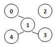
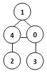
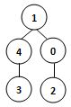
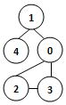
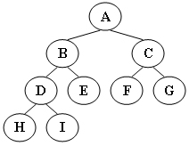

### 中国大学MOOC-陈越、何钦铭-数据结构-2019春期中考试

一、判断题(共 28 分)

1-1 一棵有124个结点的完全二叉树，其叶结点个数是确定的。 (3分)	**T**

1-2 在一棵由包含4、5、6等等一系列整数结点构成的二叉搜索树中，如果结点4和6在树的同一层，那么可以断定结点5一定是结点4和6的父亲结点。 (3分) 		**F**

1-3 如果无向图G必须进行两次广度优先搜索才能访问其所有顶点，则G中一定有回路。 (3分)	**F**

1-4 在用数组表示的循环队列中，front值一定小于等于rear值。 (2分)	**F**

1-5 若一个栈的输入序列为{1, 2, 3, 4, 5}，则不可能得到{3, 4, 1, 2, 5}这样的出栈序列。 (3分)	**T**

1-6 若一个结点是某二叉树的中序遍历序列的最后一个结点，则它必是该树的前序遍历序列中的最后一个结点。 (3分)	**F**

1-7 若一棵平衡二叉树的所有非叶结点的平衡因子都是0，则其必为完美二叉树。(3分)	**T**

1-8 算法可以没有输入，但是必须有输出。 (2分)	**T**

1-9 用邻接表法存储图，占用的存储空间数只与图中结点个数有关，而与边数无关。 (3分)		**F**

1-10 在具有*N*个结点的单链表中，访问结点和增加结点的时间复杂度分别对应为*O*(1)和*O*(*N*)。 (3分)		**F**

二、单选题(共 48 分)

2-1 若某图的深度优先搜索序列是{V1, V4, V0, V3, V2}，则下列哪个图不可能对应该序列？ (4分)  ( **C** )

A.

B.

C.

D.

2-2 设 *n* 是描述问题规模的非负整数，下列程序段的时间复杂度是：(4分) ( **B** )

```
x = 0;
while ( n >= (x+1)*(x+1) )
    x = x+1;
```

A. *O(log n)*		 B .O(n^{1/2}) 			C. *O(n)*			D. *O(n^2)*

2-3 一棵二叉树中，双分支结点数为15，单分支结点数为30，则叶子结点数为（**B**）个。 (4分)

A. 15 			B. 16 			C. 17 			D. 47

2-4 带头结点的单链表`h`为空的判定条件是： (4分) ( **B** )

A. `h == NULL;`

B. `h->next == NULL;`

C. `h->next == h;`

D. `h != NULL;`

2-5 在并查集问题中，已知集合元素0~8所以对应的父结点编号值分别是{ 1, -4, 1, 1, -3, 4, 4, 8, -2 }（注：−*n*表示树根且对应集合大小为*n*），那么将元素6和8所在的集合合并（要求必须将小集合并到大集合）后，该集合对应的树根和父结点编号值分别是多少？ (4分) ( **B** )

A. 1和-6

B. 4和-5

C. 8和-5

D. 8和-6

2-6 下列函数中，哪个函数具有最慢的增长速度：(4分) ( **B** )

A. *N^(1.5)*

B. *N log N^2*

C. *N^2 log N*

D. *N (log N)^2*

2-7 假设有5个整数以1、2、3、4、5的顺序被压入堆栈，且出栈顺序为3、5、4、2、1，那么为了获得这样的输出，堆栈大小至少为： (4分) ( **C** )

A. 2			B. 3			C. 4			D. 5

2-8 已知一棵完全二叉树的第6层（设根为第1层）有8个叶结点，则该完全二叉树的结点个数最多是： (4分)( **C** )

A. 39		B. 52		C. 111		D. 119

2-9 设一段文本中包含4个对象{a,b,c,d}，其出现次数相应为{4,2,5,1}，则该段文本的哈夫曼编码比采用等长方式的编码节省了多少位数？ (4分)( **B** )

A. 0			B. 2			C. 4			D. 5

2-10 循环顺序队列中是否可以插入下一个元素（**A**）。 (4分)

A. 与队头指针和队尾指针的值有关

B. 只与队尾指针的值有关，与队头指针的值无关

C. 只与数组大小有关，与队首指针和队尾指针的值无关

D. 与曾经进行过多少次插入操作有关

2-11 在将数据序列（ 6, 1, 5, 9, 8, 4, 7 ）建成大根堆时，正确的序列变化过程是：(4分)（**A**）

A. 6,1,7,9,8,4,5 → 6,9,7,1,8,4,5 → 9,6,7,1,8,4,5 → 9,8,7,1,6,4,5

B. 6,9,5,1,8,4,7 → 6,9,7,1,8,4,5 → 9,6,7,1,8,4,5 → 9,8,7,1,6,4,5

C. 6,9,5,1,8,4,7 → 9,6,5,1,8,4,7 → 9,6,7,1,8,4,5 → 9,8,7,1,6,4,5

D. 6,1,7,9,8,4,5 → 7,1,6,9,8,4,5 → 7,9,6,1,8,4,5 → 9,7,6,1,8,4,5 → 9,8,6,1,7,4,5

2-12 先序遍历图示二叉树的结果为 (4分)（**B**）



A. A，B，C，D，H，E，I，F，G

B. A，B，D，H，I，E，C，F，G

C. H，D，I，B，E，A，F，C，G

D. H，I，D，B，E，F，G，A，C

三、程序填空题(共 24 分)

5-1 下列代码的功能是将大顶堆`H`中指定位置`P`上的元素的整数键值上调`D`个单位，然后继续将`H`调整为大顶堆。

```c++
void IncreaseKey( int P, int D, PriorityQueue H )
{
   int i, key;
   key = H->Elements[P] + D;
   for ( i = /* P (6分)*/;H->Elements[i/2] < key; i/=2 ) 
   		/* H->Elements[i] = H->Elements[i/2] ] (6分)*/;
   H->Elements[i] = key;
}
```

5-2 下列代码的功能是返回带头结点的单链表`L`的逆转链表。

```c++
List Reverse( List L )
{
    Position Old_head, New_head, Temp;
    New_head = NULL;
    Old_head = L->Next;

    while ( Old_head )  {
        Temp = Old_head->Next;
        /* Old_head->Next = New_head (6分) */;  
        New_head = Old_head;  
        Old_head = Temp; 
    }
    /* L->Next = New_head (6分)*/;
    return L;
}
```