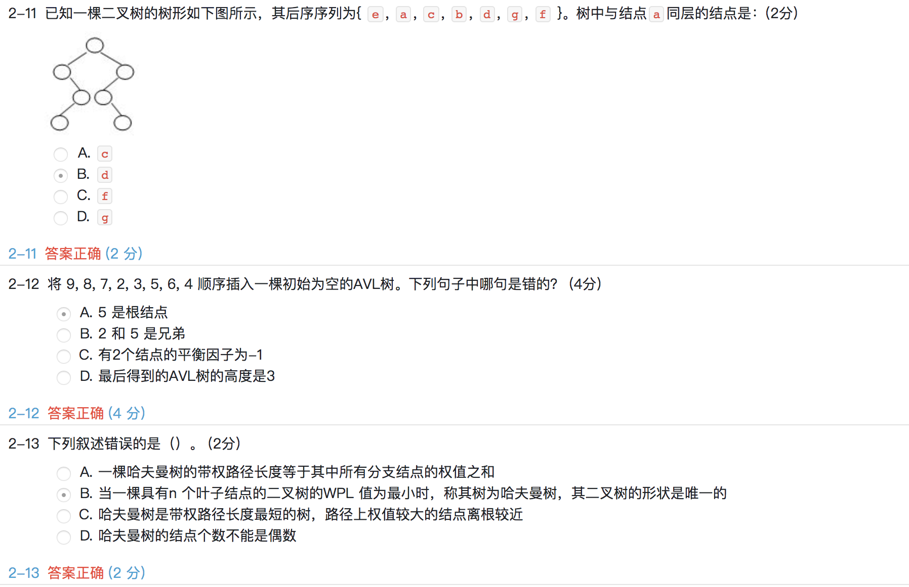

### 中国大学MOOC-陈越、何钦铭-数据结构-2019春期末考试

一、判断题(共 10 分)

1-1 对一棵平衡二叉树，所有非叶结点的平衡因子都是0，当且仅当该树是完全二叉树。(2分)	**F**

1-2 对N个不同的数据采用冒泡排序进行从大到小的排序，当元素基本有序时交换元素次数肯定最多。 (2分)	**F**

1-3 在任一有向图中，所有顶点的入度之和等于所有顶点的出度之和。 (2分)	**T**

1-4 *N log N^2* 和*N log N*具有相同的增长速度。 (2分)	**T**

1-5 若用平方探测法解决冲突，则插入新元素时，若散列表容量为质数，插入就一定可以成功。 (2分)	**F**

二、单选题(共 64 分)





三、程序填空题(共 18 分)

5-1 The function is to do topological sort on a graph `G`. `TopNum[]` starts counting from 1.

```c++
void Topsort( Graph G )
{
   Queue Q;
   Vertex V, W;
   NodePtr ptr;
   int counter = 0;

   Q = CreateEmptyQueue(NumVertex);
   for ( V=0; V<G->NumV; V++ )
      if ( Indegree[V] == 0 )
         Enqueue(V, Q);
   while ( !IsEmpty(Q) ){
      V = Dequeue( Q );
      TopNum[V] = /*  ++counter (4分) */;
      for ( ptr=G->List[V]; ptr; ptr=ptr->Next) {
         W = ptr->Vertex;
         if ( /*  --Indegree[W]   (5分)*/ == 0 )
            Enqueue(W, Q);
      }
   }
   if ( counter != NumVertex )
      printf("ERROR: Graph has a cycle.\n");
   DisposeQueue(Q);
}
```

5-2 本函数的功能是从有`N`个元素的线性表`A`中查找第`K`小的元素。其中函数`BuildMaxHeap(H, K)`是将元素`H[1]` ... `H[K]`调整为一个最大堆。请完成下列填空。

```c++
ElementType FindKthSmallest ( int A[], int N, int K )
{   /* it is assumed that K<=N */
    ElementType *H;
    int i, next, child;

    H = (ElementType *)malloc((K+1)*sizeof(ElementType));
    for ( i=1; i<=K; i++ ) H[i] = A[i-1];
    BuildMaxHeap(H, K);

    for ( next=K; next<N; next++ ) {
        H[0] = A[next];
        if ( H[0] < H[1] ) {
            for ( i=1; i*2<=K; i=child ) {
                child = i*2;
                if ( child!=K && /* H[child+1]>H[child] (4分)*/ ) child++;
                if ( /* H[child]>H[0] (5分)*/ )
                    H[i] = H[child];
                else break;
            }
            H[i] = H[0];
        }
    }
    return H[1];
}
```


四、编程题(共 8 分)

**7-1 还原二叉树 (8 分)**

给定一棵二叉树的先序遍历序列和中序遍历序列，要求计算该二叉树的高度。

### 输入格式:

输入首先给出正整数N（≤50），为树中结点总数。下面两行先后给出先序和中序遍历序列，均是长度为N的不包含重复英文字母（区别大小写）的字符串。

### 输出格式:

输出为一个整数，即该二叉树的高度。

### 输入样例:

```in
9
ABDFGHIEC
FDHGIBEAC
```

### 输出样例:

```out
5
```

**解答：**

```c++
#include <cstdio>
#include <cstdlib>

typedef struct node {
	char data;
	struct node * left;
	struct node * right;
} BTNode;

BTNode * createBTree(char preorder[], char inorder[], int len) {
	BTNode * root;
	if (len == 0) {
		return NULL;
	}
	int i = 0;
	root = (BTNode *)malloc(sizeof(BTNode));
	root->data = preorder[0];
	while (inorder[i] != preorder[0]) {
		i++;
	}
	root->left = createBTree(preorder + 1, inorder, i);
	root->right = createBTree(preorder + i + 1, inorder + i + 1, len - i - 1);
	return root;
}

int getHeight(BTNode * root) {
	if (root == NULL) {
		return 0;
	}
	int left = getHeight(root->left);
	int right = getHeight(root->right);
	return left > right ? (left + 1) : (right + 1);
}

int main() {
	int n;
	scanf("%d", &n);
	char preorder[n], inorder[n];
	scanf("%s", preorder);
	scanf("%s", inorder);
	BTNode * root = createBTree(preorder, inorder, n);
	int height = getHeight(root);
	printf("%d\n", height);
	return 0;
}
```

