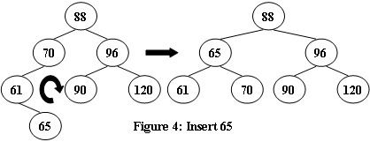

### 04-树5 Root of AVL Tree (25 分)

An AVL tree is a self-balancing binary search tree. In an AVL tree, the heights of the two child subtrees of any node differ by at most one; if at any time they differ by more than one, rebalancing is done to restore this property. Figures 1-4 illustrate the rotation rules.




Now given a sequence of insertions, you are supposed to tell the root of the resulting AVL tree.

### Input Specification:

Each input file contains one test case. For each case, the first line contains a positive integer *N* (≤20) which is the total number of keys to be inserted. Then *N* distinct integer keys are given in the next line. All the numbers in a line are separated by a space.

### Output Specification:

For each test case, print the root of the resulting AVL tree in one line.

### Sample Input 1:

```in
5
88 70 61 96 120
```

### Sample Output 1:

```out
70
```

### Sample Input 2:

```
7
88 70 61 96 120 90 65
```

### Sample Output 2:

```
88
```